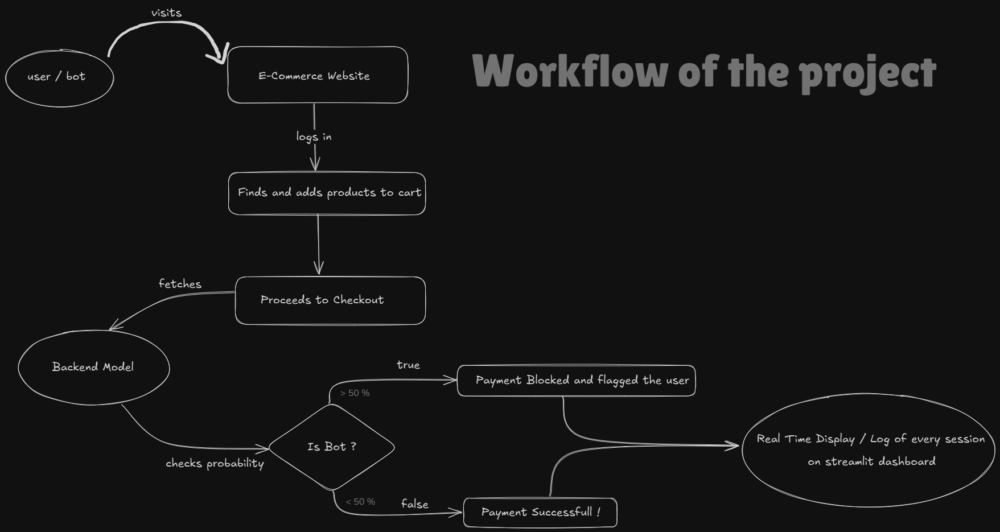

# 🛡️ Real-Time Bot Detection System for E-Commerce

## 📖 Project Overview

During high-traffic holiday seasons, e-commerce websites face attacks from **Grinch Bots** – automated scripts that purchase high-demand items faster than any human customer. These bots resell items at inflated prices or manipulate demand by hoarding products, leading to unfair user experiences and revenue loss.

Our solution is a **real-time bot detection system** that identifies and blocks bots during checkout, ensuring purchases are completed only by genuine users.

---

## 🔍 Problem Statement

- Grinch Bots dominate checkout processes during flash sales.
- Human customers lose access to products.
- Businesses face inventory issues and reputational damage.

---

## 🔑 Solution Summary

We built a modular system with:

- 🖥️ **E-commerce Website** (user interface)
- ⚙️ **Backend API** (handles session data)
- 🧠 **ML Model Backend** (classifies human vs. bot)
- 📊 **Admin Dashboard** (live monitoring)

The system uses machine learning models trained on a Kaggle dataset to analyze session data and predict bot activity. If a bot is detected, the system blocks payment and logs the attempt.

---

## 🔗 Live Demo Links

| Component             | Link                                                                                            |
| --------------------- | ----------------------------------------------------------------------------------------------- |
| 🛒 E-commerce Website | [walmart-dp.vercel.app](https://walmart-dp.vercel.app/)                                         |
| 🔗 Backend API        | [walmart-app.onrender.com](https://walmart-app.onrender.com)                                    |
| 🤖 ML Model Backend   | [bot-detector-model-backend.onrender.com](https://bot-detector-model-backend.onrender.com)      |
| 📊 Admin Dashboard    | [bot-detector-model-dashboard.onrender.com](https://bot-detector-model-dashboard.onrender.com/) |

---

### 🔄 Data Flow Diagram
 
 

1. **Session Tracking** – Tracks user behavior: clicks, navigation, response times.
2. **Data Transfer** – Frontend sends session data to backend API.
3. **Classification** – ML backend evaluates data and predicts user type.
4. **Action** – Human: Payment processed; Bot: Payment blocked and flagged.
5. **Live Monitoring** – Admin dashboard shows detection results in real time.

---

## 📊 Dataset

- **Source:** [IRCTC Bot Detection Dataset (Kaggle)](https://www.kaggle.com/datasets/subradeepdas02/irctc-bot-detection-dataset)
- **Features Used:**
  - Session duration
  - Number of clicks
  - Time between requests
  - Navigation depth
  - Response time

---

## 🛠️ Tech Stack

| Component        | Technology           |
| ---------------- | -------------------- |
| Frontend         | Next.js, React.js    |
| Backend API      | Node.js, Express.js  |
| ML Model Backend | Python, Flask        |
| Dashboard        | Streamlit            |
| Bot Simulation   | Python               |
| ML Libraries     | Scikit-learn, Pandas |

---

## 🌟 Key Features

- ⏱️ Real-time detection and prevention.
- 🛠️ Custom Grinch Bot simulator for testing.
- 📊 Dashboard with live detection results.
- 🔄 Modular architecture for easy scaling.

---

## 👥 Team Contributions

| Name              | Role                        |
| ----------------- | --------------------------- |
| Madhav Raj Sharma | Detection System & ML Model |
| Dilpreet Singh    | Full Stack Web Development  |
| Ayush Karn        | Bot Simulation              |

---

## 🚀 Future Improvements

- Dockerize all components for scalable deployment.
- Integrate CAPTCHA fallback for flagged users.
- Collect live traffic data to enhance model accuracy.
- Add integration with payment gateways for direct blocking.

---

## 🏅 Recognition

Built for Walmart Sparkathon to solve a real-world problem of unfair e-commerce practices during high-demand events.